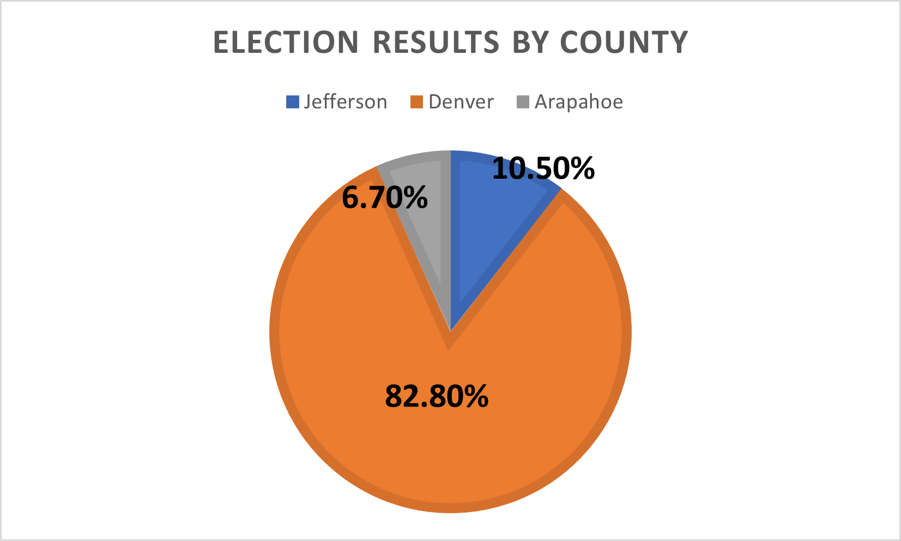

# Election Analysis
Python Code used to analyze Election Results

### Resources
- Visual Studio Code 1.60.2
- Python 3.7, 64 bits
- Data Source: Election_Results.csv

## Overview of Election Audit:

The purpose of this election audit is to assist the Colorado Board of Elections with a detailed analysis of their raw numbers. This audit can be used to verify the results of an election. Using Python, we are able to tabulate the total number of voters, count how many voters are from which counties and count how many voters voted for each candidate. With the total votes casted, and the amount of votes per county/per candidate, we also will be able to calculate percentages. 

## Election-Audit Results: 
- In this congressional election there were 369,711 votes cast.
- There were three counties that were calculated in this election. Below you will see a total of the votes of that county, as well as it's percentage of the total.
    1. **Arapahoe**: 24,801 votes (6.7% of the total vote) 
    2. **Denver**: 306,055 votes (82.8% of the total vote)
    3. **Jefferson**: 38,855 votes (10.5% of the total vote)

- **Denver**, as seen above, had the most votes cast in it's county.

- There were 3 candidates in this election, their results were:
    - **Charles Casper Stockham** received 23.0% of the vote with 85,213 number of votes.
    - **Diana DeGette** received 73.8% of the vote with 272,892 number of votes.
    - **Raymon Anthony Doane** received 3.1% of the vote with 11,606 number of votes.

- **Diana Degette** is the winner of the election with 272,892 votes. This was 73.8% of the total vote. More than 2/3 of the total vote and approaching 3/4.

## Election-Audit Summary: 
Using this Election Audit, election results can easily be verified and double checked. This audit can be converted to run and access results from any .csv file providing the raw numbers of an election. It can easily be moved and is already set up to do the "heavy technical lifting," but will produce results that are easy for most to process. As seen here:

One modification that could be made to this audit would be to breakdown each counties numbers by candidate, to pinpoint where each candidate got the most/least votes. It can then be possibly used for campaign/marketing purposes. This audit could also be modified to predict voter involvement for future elections. It can target better voting markets to see patterns or even assist with local legislation. Based on region it can even be used to consider future candidates winning possibilities and the amount of voters to normally cast their vote. 

